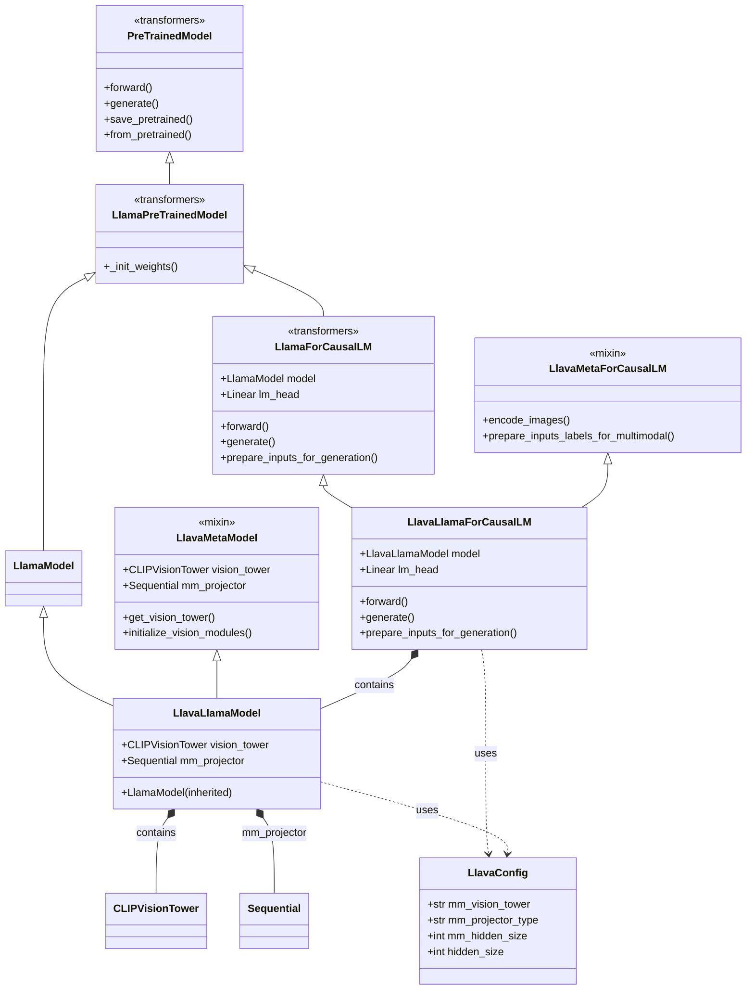
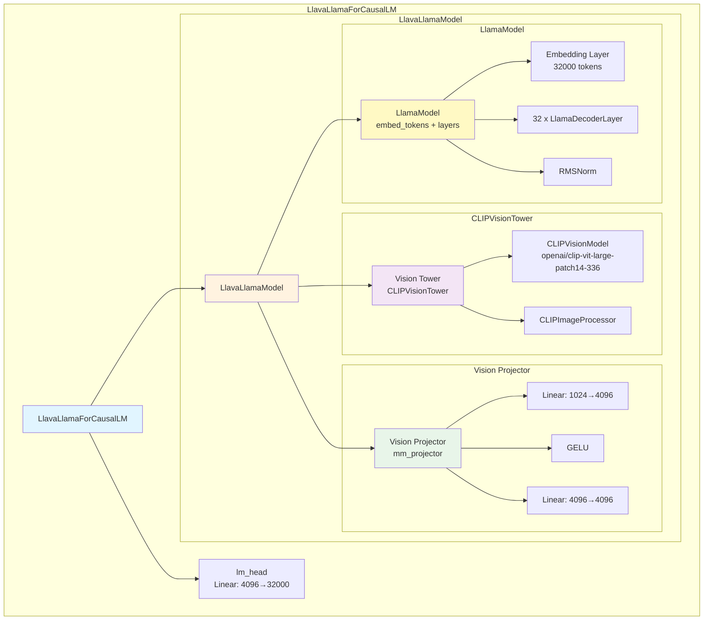
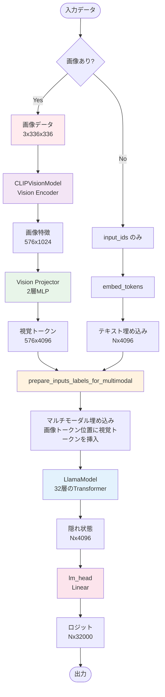
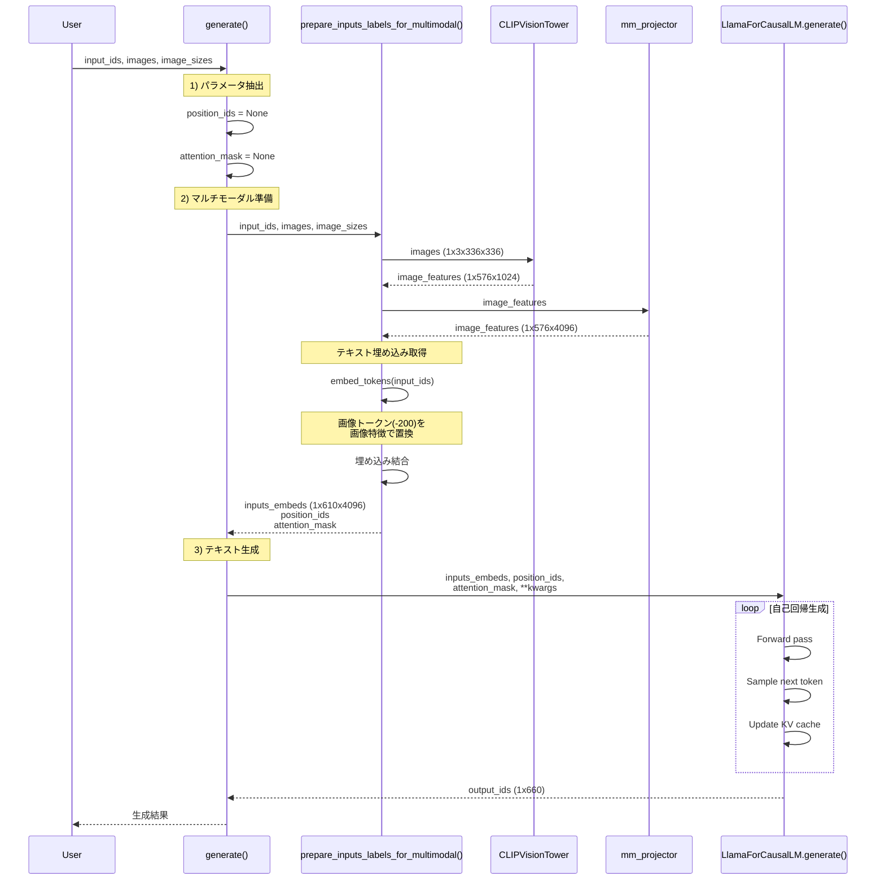
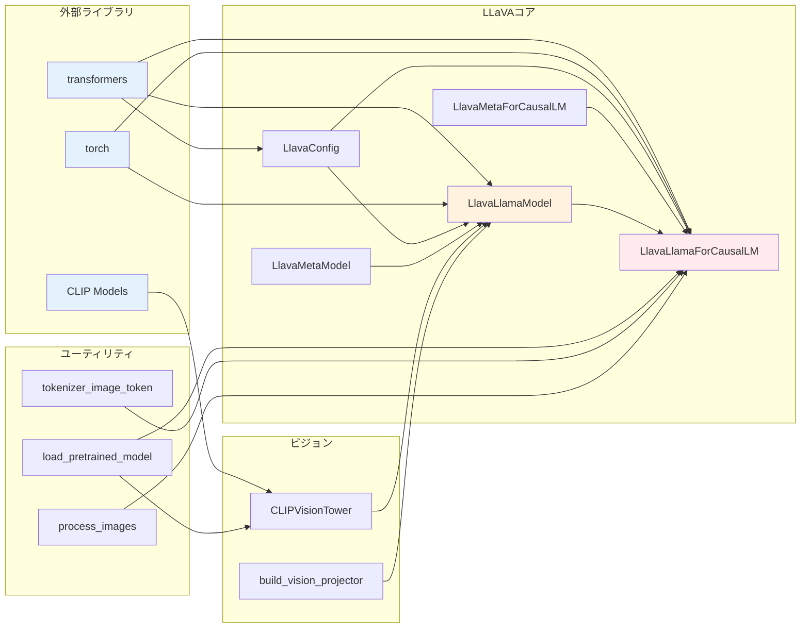
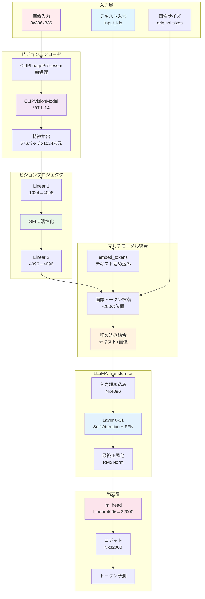

```mermaid
classDiagram
    %% 基底クラス
    class PreTrainedModel {
        <<transformers>>
        +forward()
        +generate()
        +save_pretrained()
        +from_pretrained()
    }

    class LlamaPreTrainedModel {
        <<transformers>>
        +_init_weights()
    }

    class LlamaForCausalLM {
        <<transformers>>
        +LlamaModel model
        +Linear lm_head
        +forward()
        +generate()
        +prepare_inputs_for_generation()
    }

    %% LLaVAのメタクラス
    class LlavaMetaModel {
        <<mixin>>
        +CLIPVisionTower vision_tower
        +Sequential mm_projector
        +get_vision_tower()
        +initialize_vision_modules()
    }

    class LlavaMetaForCausalLM {
        <<mixin>>
        +encode_images()
        +prepare_inputs_labels_for_multimodal()
    }

    %% LLaVA実装クラス
    class LlavaConfig {
        +str mm_vision_tower
        +str mm_projector_type
        +int mm_hidden_size
        +int hidden_size
    }

    class LlavaLlamaModel {
        +LlamaModel (inherited)
        +CLIPVisionTower vision_tower
        +Sequential mm_projector
    }

    class LlavaLlamaForCausalLM {
        +LlavaLlamaModel model
        +Linear lm_head
        +forward()
        +generate()
        +prepare_inputs_for_generation()
    }

    %% 継承関係
    PreTrainedModel <|-- LlamaPreTrainedModel
    LlamaPreTrainedModel <|-- LlamaForCausalLM
    LlamaForCausalLM <|-- LlavaLlamaForCausalLM
    LlavaMetaForCausalLM <|-- LlavaLlamaForCausalLM

    LlamaPreTrainedModel <|-- LlamaModel
    LlamaModel <|-- LlavaLlamaModel
    LlavaMetaModel <|-- LlavaLlamaModel

    %% コンポジション
    LlavaLlamaForCausalLM *-- LlavaLlamaModel : contains
    LlavaLlamaModel *-- CLIPVisionTower : contains
    LlavaLlamaModel *-- Sequential : mm_projector

    %% 設定
    LlavaLlamaForCausalLM ..> LlavaConfig : uses
    LlavaLlamaModel ..> LlavaConfig : uses
```

## コンポーネント構成図

```mermaid
graph TB
    subgraph "LlavaLlamaForCausalLM"
        A[LlavaLlamaForCausalLM]
        A --> B[LlavaLlamaModel]
        A --> C[lm_head<br/>Linear: 4096→32000]
        
        subgraph "LlavaLlamaModel"
            B --> D[Vision Tower<br/>CLIPVisionTower]
            B --> E[Vision Projector<br/>mm_projector]
            B --> F[LlamaModel<br/>embed_tokens + layers]
            
            subgraph "CLIPVisionTower"
                D --> G[CLIPVisionModel<br/>openai/clip-vit-large-patch14-336]
                D --> H[CLIPImageProcessor]
            end
            
            subgraph "Vision Projector"
                E --> I[Linear: 1024→4096]
                E --> J[GELU]
                E --> K[Linear: 4096→4096]
            end
            
            subgraph "LlamaModel"
                F --> L[Embedding Layer<br/>32000 tokens]
                F --> M[32 x LlamaDecoderLayer]
                F --> N[RMSNorm]
            end
        end
    end
    
    style A fill:#e1f5ff
    style B fill:#fff3e0
    style D fill:#f3e5f5
    style E fill:#e8f5e9
    style F fill:#fff9c4
```

### データフロー図

```mermaid
flowchart TD
    Start([入力データ]) --> A{画像あり?}
    
    A -->|Yes| B[画像データ<br/>3x336x336]
    A -->|No| G[input_ids のみ]
    
    B --> C[CLIPVisionModel<br/>Vision Encoder]
    C --> D[画像特徴<br/>576x1024]
    D --> E[Vision Projector<br/>2層MLP]
    E --> F[視覚トークン<br/>576x4096]
    
    G --> H[embed_tokens]
    H --> I[テキスト埋め込み<br/>Nx4096]
    
    F --> J[prepare_inputs_labels_for_multimodal]
    I --> J
    
    J --> K[マルチモーダル埋め込み<br/>画像トークン位置に視覚トークンを挿入]
    
    K --> L[LlamaModel<br/>32層のTransformer]
    L --> M[隠れ状態<br/>Nx4096]
    M --> N[lm_head<br/>Linear]
    N --> O[ロジット<br/>Nx32000]
    
    O --> End([出力])
    
    style B fill:#ffebee
    style C fill:#f3e5f5
    style E fill:#e8f5e9
    style J fill:#fff3e0
    style L fill:#e3f2fd
    style N fill:#fce4ec
```

## 生成プロセス図

```mermaid
sequenceDiagram
    participant User
    participant Generate as generate()
    participant Prepare as prepare_inputs_labels_for_multimodal()
    participant VisionTower as CLIPVisionTower
    participant Projector as mm_projector
    participant LlamaGen as LlamaForCausalLM.generate()
    
    User->>Generate: input_ids, images, image_sizes
    
    Note over Generate: 1) パラメータ抽出
    Generate->>Generate: position_ids = None
    Generate->>Generate: attention_mask = None
    
    Note over Generate: 2) マルチモーダル準備
    Generate->>Prepare: input_ids, images, image_sizes
    
    Prepare->>VisionTower: images (1x3x336x336)
    VisionTower-->>Prepare: image_features (1x576x1024)
    
    Prepare->>Projector: image_features
    Projector-->>Prepare: image_features (1x576x4096)
    
    Note over Prepare: テキスト埋め込み取得
    Prepare->>Prepare: embed_tokens(input_ids)
    
    Note over Prepare: 画像トークン(-200)を<br/>画像特徴で置換
    Prepare->>Prepare: 埋め込み結合
    
    Prepare-->>Generate: inputs_embeds (1x610x4096)<br/>position_ids<br/>attention_mask
    
    Note over Generate: 3) テキスト生成
    Generate->>LlamaGen: inputs_embeds, position_ids,<br/>attention_mask, **kwargs
    
    loop 自己回帰生成
        LlamaGen->>LlamaGen: Forward pass
        LlamaGen->>LlamaGen: Sample next token
        LlamaGen->>LlamaGen: Update KV cache
    end
    
    LlamaGen-->>Generate: output_ids (1x660)
    Generate-->>User: 生成結果
```

## モジュール依存関係図

```mermaid
graph LR
    subgraph "外部ライブラリ"
        TF[transformers]
        PT[torch]
        CLIP[CLIP Models]
    end
    
    subgraph "LLaVAコア"
        Config[LlavaConfig]
        Meta1[LlavaMetaModel]
        Meta2[LlavaMetaForCausalLM]
        Model[LlavaLlamaModel]
        CausalLM[LlavaLlamaForCausalLM]
    end
    
    subgraph "ビジョン"
        VT[CLIPVisionTower]
        VP[build_vision_projector]
    end
    
    subgraph "ユーティリティ"
        Load[load_pretrained_model]
        Token[tokenizer_image_token]
        Proc[process_images]
    end
    
    TF --> Config
    TF --> Model
    TF --> CausalLM
    PT --> Model
    PT --> CausalLM
    CLIP --> VT
    
    Config --> Model
    Config --> CausalLM
    Meta1 --> Model
    Meta2 --> CausalLM
    Model --> CausalLM
    
    VT --> Model
    VP --> Model
    
    Load --> CausalLM
    Load --> VT
    Token --> CausalLM
    Proc --> CausalLM
    
    style TF fill:#e3f2fd
    style PT fill:#e3f2fd
    style CLIP fill:#e3f2fd
    style CausalLM fill:#ffebee
    style Model fill:#fff3e0
```

## 詳細アーキテクチャ

```mermaid
graph TB
    subgraph "入力層"
        I1[テキスト入力<br/>input_ids]
        I2[画像入力<br/>3x336x336]
        I3[画像サイズ<br/>original sizes]
    end
    
    subgraph "ビジョンエンコーダ"
        V1[CLIPImageProcessor<br/>前処理]
        V2[CLIPVisionModel<br/>ViT-L/14]
        V3[特徴抽出<br/>576パッチx1024次元]
    end
    
    subgraph "ビジョンプロジェクタ"
        P1[Linear 1<br/>1024→4096]
        P2[GELU活性化]
        P3[Linear 2<br/>4096→4096]
    end
    
    subgraph "マルチモーダル統合"
        M1[embed_tokens<br/>テキスト埋め込み]
        M2[画像トークン検索<br/>-200の位置]
        M3[埋め込み結合<br/>テキスト+画像]
    end
    
    subgraph "LLaMA Transformer"
        L1[入力埋め込み<br/>Nx4096]
        L2[Layer 0-31<br/>Self-Attention + FFN]
        L3[最終正規化<br/>RMSNorm]
    end
    
    subgraph "出力層"
        O1[lm_head<br/>Linear 4096→32000]
        O2[ロジット<br/>Nx32000]
        O3[トークン予測]
    end
    
    I1 --> M1
    I2 --> V1
    V1 --> V2
    V2 --> V3
    V3 --> P1
    P1 --> P2
    P2 --> P3
    P3 --> M2
    M1 --> M2
    I3 --> M2
    M2 --> M3
    M3 --> L1
    L1 --> L2
    L2 --> L3
    L3 --> O1
    O1 --> O2
    O2 --> O3
    
    style I1 fill:#e1f5ff
    style I2 fill:#ffebee
    style V2 fill:#f3e5f5
    style P2 fill:#e8f5e9
    style M3 fill:#fff3e0
    style L2 fill:#e3f2fd
    style O1 fill:#fce4ec
```